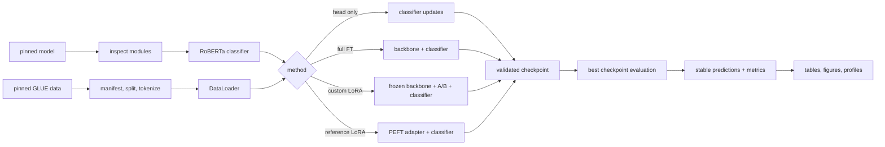

# Low-Rank Adaptation under a 6 GB GPU Budget

An independent LoRA implementation and engineering study using `FacebookAI/roberta-base` on MRPC and SST-2. The project implements the adapter and transformer injection path directly, cross-checks it against Hugging Face PEFT, and measures quality, trainable parameters, GPU memory, runtime, and artifact size on an RTX 4050 laptop GPU.

This is a scaled reproduction and engineering study, not a rerun of the original large language model experiments. The central result is mixed: the selected LoRA configuration was close to full fine-tuning on SST-2, but did not approach it on MRPC under the shared local training configuration.

## What this project includes

- Custom `LoRALinear` with frozen base weights, low-rank factors, scaling, dropout, initialization checks, and merged export.
- Exact, validated replacement of selected RoBERTa linear projections.
- Head-only, full fine-tuning, custom LoRA, and PEFT reference baselines.
- Version-pinned model and dataset loading, split manifests, stable prediction IDs, metrics, and overlap audits.
- Atomic task artifacts and resumable checkpoints containing model, optimizer, scheduler, RNG, and mixed-precision state.
- A six-hour-aware pipeline with artifact validation, status, disk guards, progress bars, and ETA reporting.
- Artifact-derived CSV tables, profiling data, and figures.

## Why LoRA

LoRA is small enough to implement and test independently, while exposing real ML engineering questions: where adapters are inserted, how gradients behave, how much memory is actually saved, and what a portable checkpoint must contain. Full fine-tuning and head-only baselines keep parameter savings separate from task quality.

## Architecture



Data flows from immutable upstream revisions to a frozen split manifest, tokenized batches, one configured training method, an optimizer-boundary checkpoint, best-checkpoint evaluation, stable-ID predictions, and artifact-derived reports.

## How LoRA works here

For a frozen linear weight:

\[
W' = W_0 + \Delta W, \qquad \Delta W = sBA, \qquad s = \alpha/r
\]

The forward pass is:

\[
y = W_0x + b + (\alpha/r)BAx
\]

Adapter-input dropout is active during training. `A` has shape `(rank, in_features)` and `B` has shape `(out_features, rank)`. The base weight and bias stay frozen; `A`, `B`, and the task classifier train.

### Actual configuration

- Backbone: `FacebookAI/roberta-base`
- Model revision: `e2da8e2f811d1448a5b465c236feacd80ffbac7b`
- Rank: `8`
- Alpha: `16.0`
- Scaling: `alpha / rank = 2.0`
- Dropout: `0.1`
- Targets: `query` and `value` projections in every RoBERTa attention layer
- Initialization: random `A`, zero `B`
- Task head: trained and included in the task artifact

Zero-initialized `B` makes the initial adapter contribution zero, preserving the pretrained function at initialization. `B` receives the useful first gradient; `A` can have zero gradient on that first backward pass, then both factors generally receive gradients after `B` changes. Tests encode this behavior.

Each adapted linear layer adds `rank * (in_features + out_features)` parameters. This reduces trainable storage and optimizer state, but frozen weights, activations, gradients, and allocator behavior still consume GPU memory. Merging is explicit: `W_merged = W_0 + sBA`; entering evaluation mode does not implicitly merge the adapter.

## Repository structure

```text
src/lora_study/
  config.py       TOML loading, validation, resolved hashes
  data.py         pinned GLUE loading, manifests, tokenization, collation
  models.py       model loading and module inspection
  lora.py         independent LoRA layer
  injection.py    exact target resolution and atomic injection
  train.py        training loop, accumulation, AMP, progress/ETA
  evaluate.py     metrics and stable-ID predictions
  checkpoints.py  atomic task and resumable training artifacts
  runner.py       one experiment run
  pipeline.py     clean, run/resume, status, orchestration
  reference.py    PEFT reference integration
  profile.py      parameter, memory, time, and file measurements
  report.py       validated aggregation and figures
configs/          smoke, baseline, and reference TOML configurations
scripts/          report, profile, audit, batch-probe, and smoke commands
tests/            mathematical, integration, data, checkpoint, and report tests
docs/             methodology, scope, results, discrepancies, interview notes
results/reliable/ committed compact tables and figure
data/             data policy; downloaded data is ignored
```

## Setup

The tested environment uses Python 3.12, `uv`, CUDA-enabled PyTorch, and an NVIDIA GPU with approximately 6 GB VRAM. Published runs used an RTX 4050 reporting 6141 MiB through `nvidia-smi`. CPU smoke tests use FP32; the benchmark matrix uses BF16 on CUDA.

```bash
UV_CACHE_DIR=.uv-cache uv sync --locked --python 3.12 --group dev
UV_CACHE_DIR=.uv-cache uv run --locked pytest tests -q
```

The model and dataset download on first use. `HF_TOKEN` is optional and only affects Hub rate limits.

## Data and evaluation

The study uses MRPC and SST-2 from the Hugging Face GLUE distribution at revision `bcdcba79d07bc864c1c254ccfcedcce55bcc9a8c`. MRPC uses `sentence1` and `sentence2`; SST-2 uses `sentence`. Labels are `not_equivalent=0, equivalent=1` for MRPC and `negative=0, positive=1` for SST-2.

The controlled local protocol derives a 90% training / 10% tuning split from the official training split and reserves the official validation split for final local evaluation. Checkpoint selection uses tuning data only. These are held-out validation scores, not GLUE test submissions. MRPC reports accuracy and positive-class binary F1; SST-2 reports accuracy. Manifests, stable IDs, content hashes, and overlap audits are saved per run.

See [data policy](data/README.md) and [experimental methodology](docs/experimental_methodology.md).

## Training and resume

Run one configuration:

```bash
UV_CACHE_DIR=.uv-cache uv run --locked lora-study \
  configs/mrpc_custom_lora.toml --output-root runs/manual
```

Available configs include `mrpc_head_only.toml`, `mrpc_full_ft.toml`, `mrpc_custom_lora.toml`, `mrpc_reference_lora.toml`, `sst2_custom_lora.toml`, and `smoke.toml`.

Run or resume the managed study:

```bash
UV_CACHE_DIR=.uv-cache uv run --locked pipeline status
UV_CACHE_DIR=.uv-cache uv run --locked pipeline run --resume --max-hours 6
```

The pipeline validates summaries, predictions, configs, and checkpoints before reuse. GPU jobs are serial and the time limit prevents starting new jobs after the budget expires. A restart continues from the latest valid optimizer-boundary checkpoint. Checkpoints restore model, optimizer, scheduler, AMP scaler when used, RNG states, epoch/batch position, and selection state. Atomic writes prevent a failed save from replacing the last valid checkpoint.

Cheap smoke path:

```bash
UV_CACHE_DIR=.uv-cache uv run --locked pipeline clean --dry-run --smoke
UV_CACHE_DIR=.uv-cache uv run --locked pipeline clean --smoke
UV_CACHE_DIR=.uv-cache uv run --locked pipeline run --smoke --resume
```

## Inference and artifacts

A completed run writes `task.pt` with the adapter or trained model state, task classifier, base-model identity, tokenizer identity, label mapping, and injection metadata. `predictions/validation.jsonl` contains stable records such as:

```json
{"example_id": 12, "prediction": 1, "label": 1}
```

For custom LoRA, load the pinned base classifier, apply the recorded injection manifest, load `task.pt`, and use either the factorized model or explicit merged export. The repository currently exposes this through Python checkpoint and injection APIs; it does not claim a separate standalone inference CLI. Prediction files are the reproducible inference outputs used by reporting.

## Results

`results/reliable/` contains 27 completed runs: 18 three-seed core baseline runs, one PEFT reference comparison, and eight MRPC ablations. Core values are mean ± sample standard deviation across seeds 1, 2, and 3.

| Task and metric | Head only | Full fine-tuning | Custom LoRA |
| --- | ---: | ---: | ---: |
| MRPC accuracy | 0.6838 ± 0.0000 | 0.8717 ± 0.0051 | 0.6928 ± 0.0086 |
| MRPC positive F1 | 0.8122 ± 0.0000 | 0.9059 ± 0.0018 | 0.8157 ± 0.0034 |
| SST-2 accuracy | 0.7867 ± 0.0284 | 0.9304 ± 0.0024 | 0.9281 ± 0.0046 |

| Core resource | Full fine-tuning | Custom LoRA |
| --- | ---: | ---: |
| Trainable parameters | 124,647,170 | 887,042 |
| MRPC peak allocated memory, mean | 2.41 GiB | 0.92 GiB |
| SST-2 peak allocated memory, mean | 2.35 GiB | 0.83 GiB |
| Task artifact | 498.7 MB | 3.57 MB |

The MRPC LoRA result is weak: it predicted the positive class for most or all validation examples. This is retained as a finding rather than hidden behind F1. The published parameter table corrects an earlier reporting error that counted merged inference weights as trainable; the correction is documented in [results](docs/results.md) and [discrepancies](docs/discrepancies.md).

Regenerate reports from completed artifacts:

```bash
UV_CACHE_DIR=.uv-cache uv run --locked python scripts/generate_results.py runs/reliable --completed-only --output results/reliable
UV_CACHE_DIR=.uv-cache uv run --locked python scripts/profile_runs.py runs/reliable --completed-only --output results/reliable/profile.csv
UV_CACHE_DIR=.uv-cache uv run --locked python scripts/audit_project.py --runs runs/reliable --completed-only --fail-on-duplicates
```

## Source traceability

| Concept | Primary source | How it is used here |
| --- | --- | --- |
| LoRA formulation | [Hu et al., arXiv 2106.09685](https://arxiv.org/abs/2106.09685) | Mathematical basis and reproduction boundary |
| Official LoRA code | [microsoft/LoRA](https://github.com/microsoft/LoRA) | Reference and attribution context |
| RoBERTa | [model card](https://huggingface.co/FacebookAI/roberta-base) | Pinned backbone and tokenizer |
| GLUE distribution | [dataset card](https://huggingface.co/datasets/nyu-mll/glue) | MRPC/SST-2 data and splits |
| PEFT reference | [Hugging Face PEFT](https://github.com/huggingface/peft) | Numerical and training parity check |
| Transformers | [documentation](https://huggingface.co/docs/transformers) | Model and tokenizer APIs |
| PyTorch | [documentation](https://pytorch.org/docs/stable/) | Modules, autograd, AMP, serialization |
| MRPC provenance | [Microsoft Research corpus](https://www.microsoft.com/en-us/download/details.aspx?id=52398) | Dataset source context |
| SST-2 provenance | [Stanford Sentiment Treebank](https://nlp.stanford.edu/sentiment/) | Dataset source context |
| GLUE benchmark | [GLUE](https://gluebenchmark.com/) | Task and metric context |

This repository’s code is MIT licensed. Upstream model and dataset terms remain in force. No model weights or dataset rows are committed.

## Further documentation

- [Architecture](docs/architecture.md)
- [Paper notes and equations](docs/paper_notes.md)
- [Reproduction scope](docs/reproduction_scope.md)
- [Experimental methodology](docs/experimental_methodology.md)
- [Results](docs/results.md)
- [Reference parity](docs/reference_parity.md)
- [Discrepancies](docs/discrepancies.md)
- [Claim ledger](docs/claim_ledger.md)
- [Limitations](docs/limitations.md)
- [Interview notes](docs/interview_notes.md)
- [Data policy](data/README.md)

## Limitations and roadmap

This is a small-model, two-task, single-GPU study. Three seeds provide useful variance estimates but cannot establish universal conclusions about LoRA. The local protocol evaluates the official validation split rather than submitting to GLUE. It does not cover GPT-3-scale training, quantization, multiple PEFT methods, distributed training, or a serving cluster.

A useful next extension would be one bounded decoder transfer study or a better-controlled MRPC LoRA hyperparameter study. Neither is required for the current implementation and efficiency findings.

## Troubleshooting

- **`uv sync` appears stuck:** inspect for another process holding `.venv/.lock`; the first PyTorch install can download several GB of CUDA wheels.
- **CUDA/BF16 error:** run `nvidia-smi`, confirm PyTorch sees the GPU, or use FP32 for CPU smoke tests.
- **Low disk space:** inspect `df -h .` and `du -sh runs .venv data logs`; use `pipeline clean --dry-run` before cleanup.
- **Corrupt checkpoint:** preserve other checkpoints; the runner validates `latest.pt` and can fall back to verified `best.pt` after disk space is recovered.
- **Duplicate report rows:** pass one intended run root, then audit with `--completed-only --fail-on-duplicates`.
- **Unexpected classifier load report:** the base checkpoint is a masked-LM checkpoint, so the downstream classification head is newly initialized and must be trained. This is expected.

## License and citation

Original project code: MIT. See [LICENSE](LICENSE) and [CITATION.cff](CITATION.cff). External paper, model, dataset, and library terms are defined by the upstream sources above.
